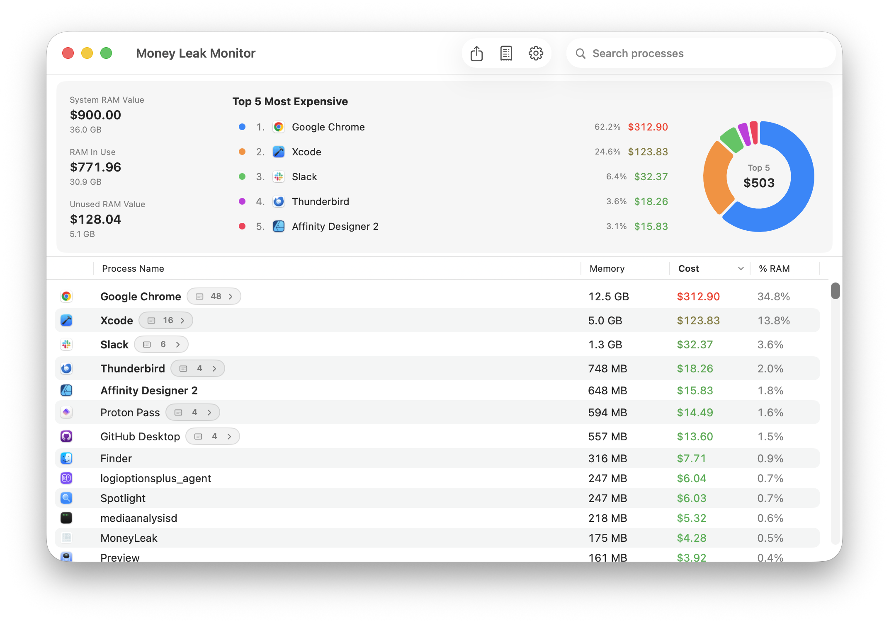
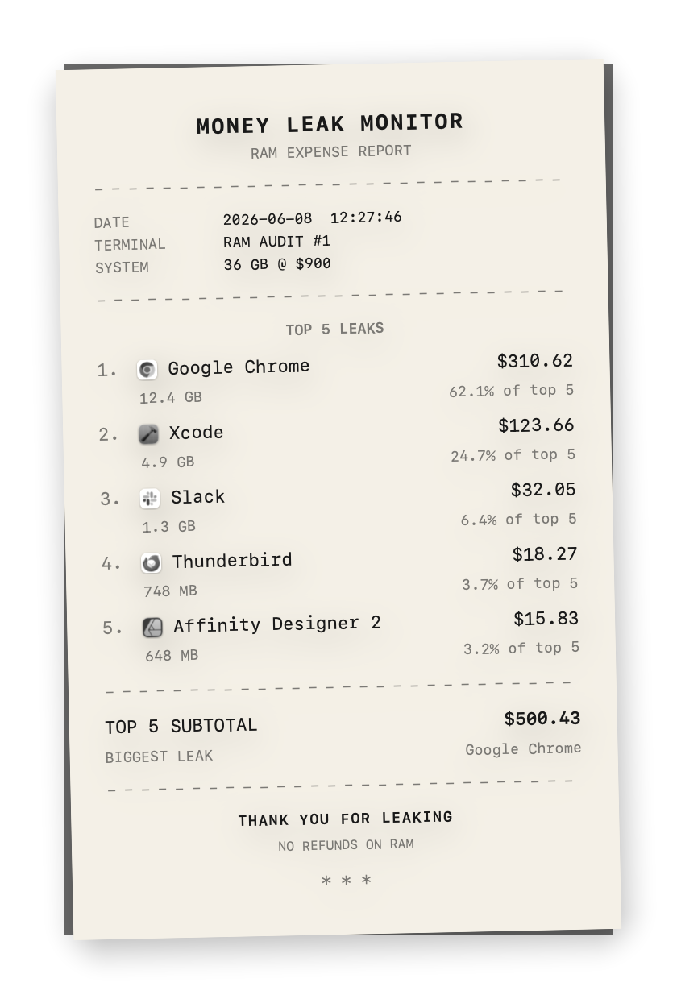

# Money Leak Monitor

A native macOS app that shows running processes and their memory usage as **dollar values** — Activity Monitor meets personal finance.



## What it does

Money Leak Monitor helps you see RAM as a shared economic budget:

- Lists running apps with memory usage translated into cost
- Groups helper processes (Chrome, Cursor, Electron apps, etc.) by `.app` bundle
- Highlights the top five most expensive apps with a linked list and donut chart
- Refreshes automatically every second (configurable)
- Lives in the menu bar with a quick RAM-cost summary

**Receipt export** — save a thermal-receipt PNG of your five most expensive apps from the toolbar.




## Requirements

- macOS 26.4+
- Xcode 26.4+
- Swift 5

The app runs **without App Sandbox** so it can enumerate system processes via `libproc`.

## Build & run

```bash
open MoneyLeak.xcodeproj
```

Select the **MoneyLeak** scheme and run (⌘R), or:

```bash
xcodebuild -scheme MoneyLeak -configuration Debug build
```

## Pricing model

By default, RAM is priced with an **opportunity-cost model**:

- Total physical RAM is detected automatically (`sysctl`)
- Default rate: **$25 per GB** (≈ $0.0244 per MB)
- Per-process cost: `memoryMB × dollarsPerMB`

This is equivalent to each process paying for its share of a synthetic full-system RAM value. No process is free; cost scales linearly with usage.

### Custom pricing

In **Settings** (⌘,), users can optionally enable **custom cost per MB** to override the default rate — for example, to reflect what they actually paid for a RAM upgrade.

## How memory is counted

Money Leak Monitor is built for **cost per app**, not for matching Activity Monitor’s system-wide memory bar. The numbers answer different questions.

**Per app:** Each running process is read with `proc_pidinfo` using **resident memory** (`pti_resident_size`). Helpers inside the same `.app` bundle (Chrome renderers, Xcode SourceKit, etc.) are merged into one row, and their memory and cost are summed. Click the process-count badge on a grouped row to see the breakdown.

**RAM In Use:** The summary total is the sum of those per-app (and standalone daemon) resident sizes. It is *not* the same as Activity Monitor’s **Memory Used**, which comes from the kernel and includes wired memory, compression, and other system categories that are never attributed to a single app row.

**Unused RAM value:** `total physical RAM − RAM In Use`. This is a budgeting shortcut for the opportunity-cost model (“what’s left of your synthetic RAM bill”), not a measure of free or reclaimable memory. macOS file cache, wired kernel memory, and processes Money Leak cannot read all land in this bucket, so **Unused RAM value is often much larger than Activity Monitor’s free memory**.

**Why resident memory:** It is a stable, per-process public API suited to ranking apps by cost. Activity Monitor’s **Memory** column uses **footprint**, which is better for system pressure but harder to attribute fairly per PID. Money Leak prioritizes comparable app-to-app cost over matching the Memory Used footer in Activity Monitor.

## Features

| Feature | Description |
|--------|-------------|
| Process table | Sortable columns: icon, name, memory, cost, % RAM |
| Bundle grouping | Helpers under the same `.app` are merged into one row |
| Process detail | Click the process-count badge on a grouped row for a per-PID breakdown (list + donut chart) |
| Summary dashboard | System RAM value, RAM in use, unused RAM value |
| Top 5 panel | List + interactive donut chart with hover linking |
| Search | Filter processes by display name (bundle basename, e.g. `logioptionsplus_agent`) |
| CSV export | Save panel lets you choose export location |
| Receipt export | Toolbar button saves a thermal-receipt PNG of the top 5 via `NSSavePanel` |
| Cost alerts | Optional notifications when a process exceeds a threshold |
| Menu bar extra | Shows total RAM cost and top processes |
| About | App menu **About Money Leak Monitor** or Settings → About — version, credits, random tagline |

## Project structure

```
MoneyLeak/
├── App/
│   └── MoneyLeakApp.swift          # @main entry, menu bar, About command
├── Models/
│   ├── ProcessMemoryInfo.swift     # Process row model
│   ├── ProcessMemberInfo.swift     # Per-PID member for grouped rows
│   ├── MemoryCostSettings.swift    # UserDefaults-backed preferences
│   ├── RAMOpportunityCostModel.swift
│   └── AppAboutInfo.swift          # Version, credits, taglines
├── Services/
│   ├── ProcessMemoryService.swift  # libproc / sysctl process enumeration
│   └── TopFiveReceiptRenderer.swift
├── ViewModels/
│   └── ProcessListViewModel.swift
├── Views/
│   ├── ProcessListView.swift       # Toolbar: CSV, receipt, settings
│   ├── ProcessTableView.swift
│   ├── ProcessDetailSheetView.swift
│   ├── MemoryCostSummaryView.swift
│   ├── TopFiveReceiptView.swift
│   ├── SettingsView.swift
│   ├── AboutView.swift
│   └── …
└── ContentView.swift               # SwiftUI preview host only
```

## System APIs

Process enumeration uses public macOS APIs only:

- `sysctl(KERN_PROC_ALL)` for the full PID list — **do not use `proc_listallpids`**, which omits many long-lived background processes (e.g. Logi Options+)
- `proc_pidinfo` → `pti_resident_size` for per-process resident memory
- `proc_pidpath` for executable path; row display name is the `.app` bundle basename (not `CFBundleDisplayName` or `proc_name`)
- `sysctl` (`HW_MEMSIZE`) for total RAM
- `host_statistics64` is not used in the current version

## Settings (persisted in UserDefaults)

- Refresh interval (0.5–10 s, default 1 s)
- Custom cost per MB (optional)
- Cost alert threshold and enable/disable

## Notes

- **Grouped rows** show one entry per app bundle; standalone daemons/CLIs remain separate. See [How memory is counted](#how-memory-is-counted) for why totals differ from Activity Monitor.
- **Display names** come from the bundle folder name (`Google Chrome.app` → `Google Chrome`). Some apps use a different marketing name in Activity Monitor (e.g. Logi Options+ appears as `logioptionsplus_agent`).
- Processes with unreadable memory (`proc_pidinfo` failure, often root-owned helpers) are omitted from rows and totals.
- `ContentView.swift` exists for Xcode canvas previews; the app launches from `MoneyLeakApp`.

## License

MIT License
